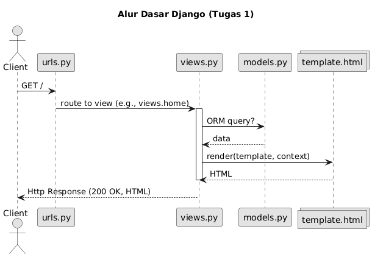
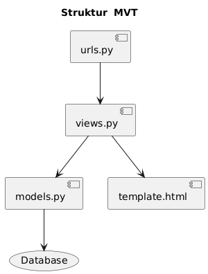
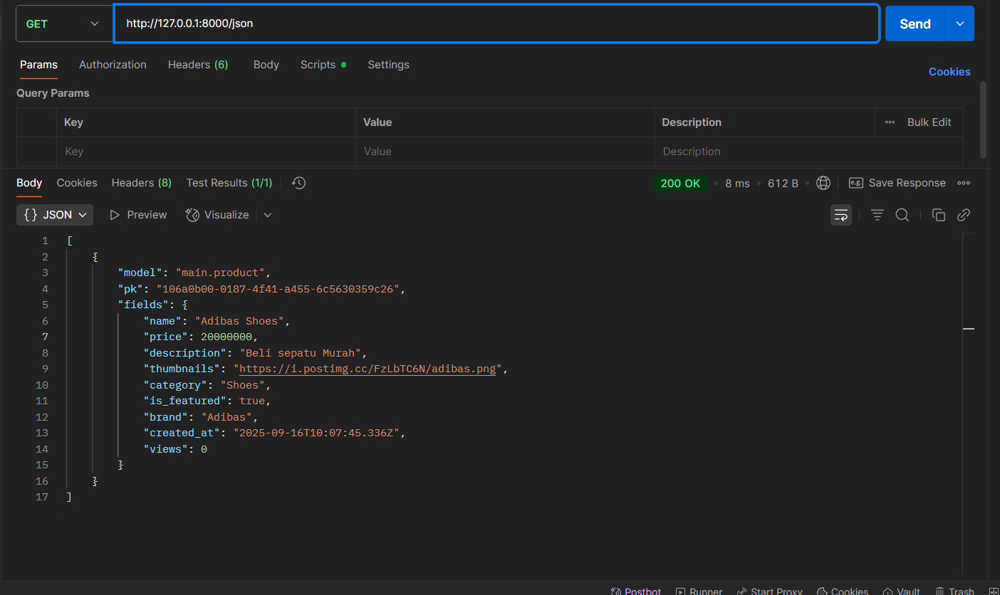
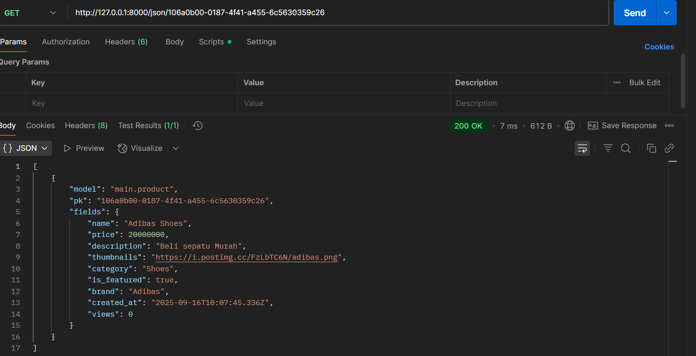
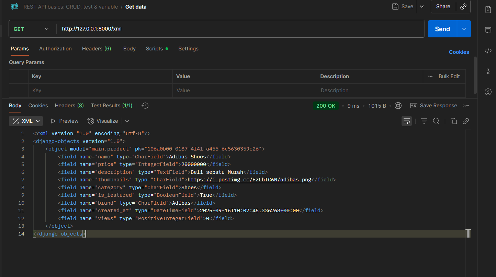
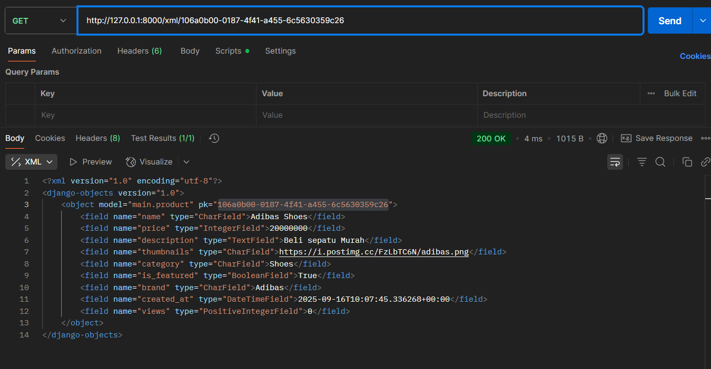

# Football Shop - Toko Sepatu Bola

## `README.md` tugas 3 Dibawah

## Link Aplikasi yang Sudah Di-Deploy
Aplikasi Football Shop saya dapat diakses di: https://pbp.cs.ui.ac.id/gregorius.ega/tokobolaega
Nama Aplikasi: Toko Bola Ega 
Nama: Gregorius Ega Aditama Sudjali
Kelas: PBP C


### 1. Jelaskan bagaimana cara kamu mengimplementasikan checklist di atas secara step-by-step (bukan hanya sekadar mengikuti tutorial).
Saya mengimplementasikan checklist tugas secara bertahap, dengan menyesuaikan tema aplikasi menjadi "Football Shop" yang fokus pada penjualan barang yang terkait dengan bola. Berikut penjelasan step-by-step berdasarkan pengalaman saya, termasuk penyesuaian dan troubleshooting yang saya lakukan:

1. **Membuat proyek Django baru**:  
   Saya membuka terminal di direktori kerja saya dan menjalankan `django-admin startproject football_shop`. Ini membuat struktur proyek dasar dengan file `manage.py`, folder `football_shop` (settings, urls, dll.), dan environment virtual baru menggunakan `python -m venv venv`. Saya mengaktifkan virtual environment dengan  `venv\Scripts\activate`. Kemudian, install Django dan Requirements `pip -r requirements.txt` dan verifikasi dengan `pip list` lalu `django-admin --version`. Saya memastikan versi Django 4.x atau lebih baru untuk kompatibilitas.

2. **Membuat aplikasi dengan nama `main` pada proyek tersebut**:  
   Di dalam direktori proyek, jalankan `python manage.py startapp main`. Ini menghasilkan folder `main` dengan file-file seperti `models.py`, `views.py`, `urls.py`, dan `admin.py`. Saya menambahkan `'main'` ke `INSTALLED_APPS` di `settings.py` untuk mengintegrasikannya ke proyek utama.

3. **Melakukan routing pada proyek agar dapat menjalankan aplikasi `main`**:  
   Di `football_shop/urls.py` (project-level), saya impor `include` dari `django.urls` dan tambahkan path: `path('', include('main.urls'))`. Ini memetakan root URL ke aplikasi `main`. Saya test dengan `python manage.py runserver` dan akses `http://127.0.0.1:8000/` untuk memastikan tidak ada error 404.

4. **Membuat model pada aplikasi `main` dengan nama `Product` dan atribut wajib**:  
   Di `main/models.py`, saya definisikan class `Product(models.Model)` dengan atribut:  
   - `name = models.CharField(max_length=100)` (untuk nama sepatu bola).  
   - `price = models.IntegerField()` (harga dalam Rupiah).  
   - `description = models.TextField()` (deskripsi fitur sepatu).  
   - `thumbnail = models.URLField()` (link gambar sepatu).  
   - `category = models.CharField(max_length=50)` (misal: 'Sepatu Lari', 'Sepatu Futsal').  
   - `is_featured = models.BooleanField(default=False)` (status unggulan).  
   Saya tambahkan atribut opsional seperti `brand = models.CharField(max_length=50)` untuk lebih kreatif. Kemudian, jalankan `python manage.py makemigrations main` dan `python manage.py migrate` untuk membuat tabel di database (default SQLite). 

5. **Membuat fungsi pada `views.py` untuk dikembalikan ke template HTML yang menampilkan nama aplikasi serta nama dan kelas**:  
   Di `main/views.py`, buat fungsi `show_main(request)`:  
   ```python
   from django.shortcuts import render
   def show_main(request):
       context = {
           'app_name': 'Football Shop',
           'nama': '[Nama Mahasiswa]',
           'kelas': '[Kelas Mahasiswa]'
       }
       return render(request, 'main/main.html', ctx)
   ```  
   Ini mengirimkan context ke template tanpa model data dulu, untuk halaman sederhana.

6. **Membuat routing pada `urls.py` aplikasi `main` untuk memetakan fungsi `main` pada `views.py`**:  
   Di `main/urls.py`, impor `path` dan `views`, lalu tambahkan routing berikut:  

   ```python
   from django.urls import path
   from . import views

   urlpatterns = [
       path("", views.main, name="main"),
   ]

7. **Melakukan deployment ke PWS terhadap aplikasi yang sudah dibuat**:  
   Setelah aplikasi selesai dibuat dan diuji di lokal, langkah berikutnya adalah melakukan *deployment* ke **Pacil Web Service (PWS)** agar dapat diakses secara daring. Prosesnya dimulai dengan mengunggah kode proyek ke GitHub, kemudian melakukan *push* ke remote PWS yang sudah dikonfigurasi. Perintah yang digunakan adalah:

   ```bash
   git add .
   git commit -m "done"
   git push origin master
   git push pws master
   ```

### 2. Buatlah bagan yang berisi request client ke web aplikasi berbasis Django beserta responnya dan jelaskan pada bagan tersebut kaitan antara urls.py, views.py, models.py, dan berkas html.
Berikut diagram sederhana :





### Penjelasan Kaitan Komponen (MVT)

- **`urls.py` (level proyek & app)**
  - Pintu masuk request. Memetakan URL dari client ke fungsi view yang tepat.
  - Contoh (project): `path("", include("main.urls"))`
  - Contoh (app): `path("", views.main, name="main")`

- **`views.py`**
  - Jembatan utama MVT: menerima request dari `urls.py`, ambil/olah data (via `models.py` bila perlu), lalu merender template.
  - Contoh: `return render(request, "main/main.html", {"products": Product.objects.all()})`

- **`models.py`**
  - Definisi struktur data & akses database lewat ORM (CRUD).
  - Contoh: 
    ```python
    class Product(models.Model):
        name = models.CharField(max_length=100)
        price = models.IntegerField()
        description = models.TextField()
        thumbnail = models.URLField()
        category = models.CharField(max_length=100)
        is_featured = models.BooleanField(default=False)
        brand = models.CharField(max_length=50, default="Unknown")
    ```

- **Template HTML (`templates/...`)**
  - Tampilan akhir. Menerima **context** dari view dan merender dinamis dengan tag Django.
  - Contoh:
    ```html
    <!doctype html>
      <html>
      <head><meta charset="utf-8"><title>{{ app_name }}</title></head>
      <body>
         <h1>{{ my_app_name|title }}</h1>
         <p>Nama: {{ my_name }}</p>
         <p>Kelas: {{ pbp_class }}</p>
      </body>
      </html>
    ```

**Alur singkat:** `Request → project/urls.py → app/urls.py → views.py → (models.py) → template → Response`  
Ini memastikan pemisahan concern: **route** (urls), **logika** (views), **data** (models), **UI** (templates).


### 3. Jelaskan peran settings.py dalam proyek Django!
`settings.py` adalah file konfigurasi pusat di level proyek Django (di folder `toko_bola_ega/settings.py`). File mengatur seluruh behavior aplikasi, seperti:  
- **Installed Apps**: Daftar aplikasi yang diaktifkan (e.g., `'main'`, `'django.contrib.admin'`). Ini memungkinkan Django load models dan middleware dari app tersebut.  
- **Database Configuration**: Setup koneksi DB (default SQLite, bisa PostgreSQL/MySQL dengan `DATABASES` dict). Termasuk engine, name, user, password.  
- **Middleware**: Daftar prosesor request/response (e.g., authentication, session).  
- **Templates**: Path ke folder templates (e.g., `DIRS = [BASE_DIR / 'main/templates']`) dan backend (DjangoTemplates).  
- **Static/Media Files**: Lokasi CSS/JS/gambar, penting untuk production.  
- **Security**: Secret key, allowed hosts, debug mode (False di production).  
- **Language/Timezone**: Default 'en-us' dan 'UTC', bisa diubah ke 'id' dan 'Asia/Jakarta'.  
Peran utamanya: Menyediakan environment-specific config, memudahkan skalabilitas dan deployment (e.g., bedakan dev vs prod). Jika salah, app bisa crash (e.g., DB error).

### 4. Bagaimana cara kerja migrasi database di Django?
Migrasi (migration) adalah proses sinkronisasi perubahan model (models.py) ke skema database. Django gunakan ORM, jadi tidak perlu SQL manual. Cara kerja step-by-step:  
1. **Buat Migrasi**: Edit models.py (e.g., tambah field). Jalankan `python manage.py makemigrations [toko_bola_ega]` (e.g., `main`). Django deteksi perubahan, buat file migrasi di `app/migrations/` (e.g., `0001_initial.py`) berisi instruksi SQL-like (CreateTable, AddField).  
2. **Apply Migrasi**: Jalankan `python manage.py migrate`. Django eksekusi file migrasi secara berurutan (berdasarkan nomor), update DB skema (tabel, kolom). Untuk initial: Buat tabel dari model.  
3. **Rollback/Check**: Gunakan `migrate [toko_bola_ega] [nomor]` untuk revert (e.g., `migrate main 0001`). `showmigrations` cek status.  
4. **Fake Migrasi**: Jika DB sudah ada skema, `migrate --fake` tandai sebagai applied tanpa eksekusi.  
Proses ini version-controlled, aman untuk tim (commit file migrasi ke Git). Troubleshooting: Konflik jika manual edit DB; solve dengan `migrate --fake-initial`.

### 5. Menurut Anda, dari semua framework yang ada, mengapa framework Django dijadikan permulaan pembelajaran pengembangan perangkat lunak?
Django adalah pilihan ideal untuk pemula karena:  
- **Batteries-Included**: Sudah include banyak fitur out-of-the-box (admin panel, ORM, auth, form handling), jadi fokus belajar logic daripada setup boilerplate. Bandingkan Flask (minimalis, butuh tambah library manual).  
- **MVT Architecture**: Struktur jelas (Model-View-Template) mirip MVC, mudah dipahami untuk transisi ke framework lain seperti Laravel atau Rails. Pemisahan concerns bantu belajar best practices.  
- **ORM dan Abstraksi**: Hindari SQL raw awal, gunakan Pythonic query (e.g., `Model.objects.filter()`), tapi bisa scale ke raw SQL nanti. Bagus untuk pemula tanpa background DB.  
- **Dokumentasi dan Komunitas**: Docs resmi lengkap dengan tutorial interaktif; komunitas besar (Stack Overflow, Django Girls).  
- **Rapid Development**: `startapp`, `makemigrations`, admin auto-generated percepat prototyping. Cocok untuk proyek kecil seperti tugas kuliah.  
- **Secure by Default**: Built-in protection CSRF, XSS, SQL injection; ajar security sejak awal.  
Meski "batteries-included" bisa overwhelming, ia bangun fondasi solid sebelum eksplor framework ringan seperti FastAPI.

### 6. Apakah ada feedback untuk asisten dosen tutorial 1 yang telah kamu kerjakan sebelumnya?
Ya, tutorial 1 sangat membantu untuk memahami MVT dasar, terutama contoh alur request-response. Namun, bisa ditambahkan lebih banyak contoh error handling (e.g., 404 di views) dan integrasi static files lebih awal, karena sering bingung saat deploy. Secara keseluruhan, jelas dan step-by-step, terima kasih Tim Ados dan Tim Dosen :D


# `README.md` tugas 3
### 1. Mengapa kita memerlukan data delivery dalam pengimplementasian sebuah platform?
Data delivery diperlukan untuk memastikan data dapat dikirim dan diterima dengan baik antara server dan klien, mendukung integrasi sistem, dan memastikan komunikasi yang efisien.

#### Manfaat Utama 
- **Reliabilitas & ketahanan** — Antrian jadi buffer untuk menyerap lonjakan dan mencegah timeout/kehilangan pesan; ketersediaan layanan meningkat.  (Microsoft, 2025)
- **Decoupling & integrasi mudah** — Pub/Sub **memisahkan** pengirim dari penerima; tim bisa mengembangkan layanan secara mandiri.  (Google Cloud, 2025)
- **Performa & skalabilitas** — Pola “queue-based load leveling” **meratakan beban** agar layanan hilir tidak kewalahan saat traffic spike.  (Microsoft, 2025)

### 2. Mana yang lebih baik antara XML dan JSON? Mengapa JSON lebih populer dibandingkan XML?
Sebetulnya tergantung pemakaian tidak ada yang `Lebih unggul` tergantung pemakaianya saja.

JSON umumnya lebih baik untuk API modern, aplikasi web/mobile, dan pertukaran data antar-layanan karena sintaksnya ringkas, mudah dibaca/di-parse, dan sudah “bawaan” JavaScript. (Ecma International, 2017)

XML masih unggul untuk data/berkas yang “dokumen-sentris” (e.g. punya mixed content), perlu skema dan validasi ketat (XSD), atau transformasi dokumen (XSLT) (W3C, 2008; W3C, 2017)

### 3. Jelaskan fungsi dari method is_valid() pada form Django dan mengapa kita membutuhkan method tersebut?
Method __validId() digunakan untuk memvalidasi ID yang dimasukkan dalam form agar sesuai dengan aturan tertentu, mencegah input yang tidak valid masuk ke database.

### 4. Mengapa kita membutuhkan csrf_token di form Django, dan apa risikonya jika tidak ada?
Kita membutuhkan `` untuk mencegah **Cross-Site Request Forgery (CSRF)**: ketika pengguna sedang login, browser otomatis menyertakan **cookie sesi** pada permintaan lintas situs; tanpa token acak yang diverifikasi server (melalui `CsrfViewMiddleware`) dan pemeriksaan asal (Origin/Referer serta `CSRF_TRUSTED_ORIGINS`), aplikasi tidak dapat membedakan permintaan sah dari yang dipalsukan. Jika token tidak ada, penyerang dapat menanam **form tersembunyi** atau skrip di situs mereka yang mengirim **POST berbahaya** (mis. ubah email/sandi, tambah admin, transaksi) menggunakan kredensial korban sehingga server keliru menganggapnya valid; atribut cookie **`SameSite`** membantu mengurangi sebagian risiko, namun **bukan pengganti** token—praktik terbaiknya tetap menyertakan `csrf_token` pada setiap form POST dan mengirimnya via header `X-CSRFToken` untuk AJAX. (Django Docs, 2025; MDN Web Docs, 2025; OWASP, n.d.)

### 5. Jelaskan bagaimana cara kamu mengimplementasikan checklist di atas secara step-by-step (bukan hanya sekadar mengikuti tutorial).

**a.** Buat **halaman form** agar pengguna bisa menambahkan objek baru dengan field yang diperlukan.  
**b.** Tambahkan **dua view** terpisah: satu untuk **membuat objek** (GET/POST) dan satu untuk **menampilkan detail** objek; sediakan **dua template HTML** masing-masing untuk form dan detail.  
**c.** Perbarui `main.html` untuk menampilkan **daftar objek** dan **tombol aksi**, lalu tautkan tiap tombol/tautan ke view terkait menggunakan **reverse URL** (``).  
**d.** Implementasikan **data delivery**: buat view yang mengembalikan **XML** dan **JSON** untuk **seluruh data** maupun **berdasarkan ID**, lalu daftarkan **routing**-nya di `urls.py`.  
**e.** Lakukan **uji manual**: jalankan server lokal (`python manage.py runserver`) dan akses endpoint di **localhost** untuk memastikan semuanya berfungsi.  
**f.** **Terakhir**, lakukan **deploy ke PWS**, pastikan konfigurasi (mis. `ALLOWED_HOSTS`, `CSRF_TRUSTED_ORIGINS`) sudah benar.

## Postman Screen Shoot





###  Apakah ada feedback untuk asdos di tutorial 2 yang sudah kalian kerjakan?
saya ingin tutorial lebih inetraktif/diberi materi sebelum mengerjakan tutorial

## sources
Microsoft. (n.d.). Queue-based load leveling pattern (Azure Architecture Center). https://learn.microsoft.com/en-us/azure/architecture/patterns/queue-based-load-leveling. (Diakses 16 September 2025).

Google Cloud. (n.d.). What is Pub/Sub? (Overview). https://cloud.google.com/pubsub/docs/overview. (Diakses 16 September 2025).

W3C. (2008). Extensible Markup Language (XML) 1.0 (Fifth Edition)

Ecma International. (2017). ECMA-404: The JSON Data Interchange Syntax (2nd ed.)

W3C. (2017). XSL Transformations (XSLT) Version 3.0.
Django Software Foundation. (n.d.). *Cross site request forgery (CSRF) protection*. https://docs.djangoproject.com/en/5.2/ref/csrf/ (Diakses 16 September 2025)

Django Software Foundation. (n.d.). *How to use Django’s CSRF protection*. https://docs.djangoproject.com/en/5.2/howto/csrf/ (Diakses 16 September 2025)

Django Software Foundation. (n.d.). *Settings: CSRF_TRUSTED_ORIGINS*. https://docs.djangoproject.com/en/5.2/ref/settings/ (Diakses 16 September 2025)

Mozilla. (2025, September 1). *Using HTTP cookies*. MDN Web Docs. https://developer.mozilla.org/en-US/docs/Web/HTTP/Guides/Cookies

Mozilla. (2025, June 7). *Cross-site request forgery (CSRF)*. MDN Web Docs. https://developer.mozilla.org/en-US/docs/Web/Security/Attacks/CSRF

OWASP Foundation. (n.d.). *Cross-Site Request Forgery (CSRF) Prevention Cheat Sheet*. OWASP Cheat Sheet Series. https://cheatsheetseries.owasp.org/cheatsheets/Cross-Site_Request_Forgery_Prevention_Cheat_Sheet.html

OWASP Foundation. (n.d.). *SameSite*. https://owasp.org/www-community/SameSite